# Estimation Approach to Statistical Inference
## Between Subjects Vignette

### Three Group Example Data


```r
Group <- c(rep(1,3),rep(2,3),rep(3,3))
Outcome <- c(3,4,5,7,8,9,8,9,10)
Group <- factor(Group,levels=c(1,2,3),labels=c("Group1","Group2","Group3"))

BetweenData <- data.frame(Group,Outcome)
BetweenData
```

```
##    Group Outcome
## 1 Group1       3
## 2 Group1       4
## 3 Group1       5
## 4 Group2       7
## 5 Group2       8
## 6 Group2       9
## 7 Group3       8
## 8 Group3       9
## 9 Group3      10
```

### Analyses of Multiple Groups

#### Confidence Intervals for the Means


```r
.ciMeans(Outcome~Group)
```

```
##        N M SD    SE    LL     UL
## Group1 3 4  1 0.577 1.516  6.484
## Group2 3 8  1 0.577 5.516 10.484
## Group3 3 9  1 0.577 6.516 11.484
```

```r
.ciMeans(Outcome~Group,conf.level=.99)
```

```
##        N M SD    SE    LL    UL
## Group1 3 4  1 0.577 -1.73  9.73
## Group2 3 8  1 0.577  2.27 13.73
## Group3 3 9  1 0.577  3.27 14.73
```

#### Plot of the Confidence Intervals for the Means


```r
.cipMeans(Outcome~Group)
```

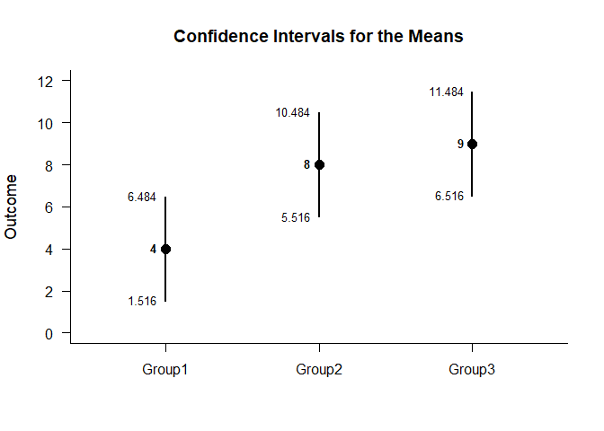<!-- -->

```r
.cipMeans(Outcome~Group,conf.level=.99,mu=5)
```

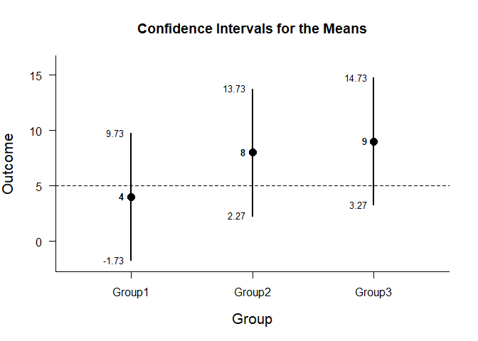<!-- -->

#### Significance Tests for the Means


```r
.nhstMeans(Outcome~Group)
```

```
##        Diff    SE      t df     p
## Group1    4 0.577  6.928  2 0.020
## Group2    8 0.577 13.856  2 0.005
## Group3    9 0.577 15.588  2 0.004
```

```r
.nhstMeans(Outcome~Group,mu=5)
```

```
##        Diff    SE      t df     p
## Group1   -1 0.577 -1.732  2 0.225
## Group2    3 0.577  5.196  2 0.035
## Group3    4 0.577  6.928  2 0.020
```

### Analyses of a Group Comparison

#### Confidence Interval for a Mean Difference


```r
Comparison=factor(Group,c("Group1","Group2"))
.ciDifference(Outcome~Comparison)
```

```
##            Diff    SE df     LL     UL
## Comparison   -4 0.816  4 -6.267 -1.733
```

```r
.ciDifference(Outcome~Comparison,conf.level=.99)
```

```
##            Diff    SE df     LL     UL
## Comparison   -4 0.816  4 -6.267 -1.733
```

```r
Comparison=factor(Group,c("Group3","Group1"))
.ciDifference(Outcome~Comparison)
```

```
##            Diff    SE df    LL    UL
## Comparison    5 0.816  4 2.733 7.267
```

#### Plot of the Confidence Interval for the Mean Difference


```r
Comparison=factor(Group,c("Group1","Group2"))
.cipDifference(Outcome~Comparison)
```

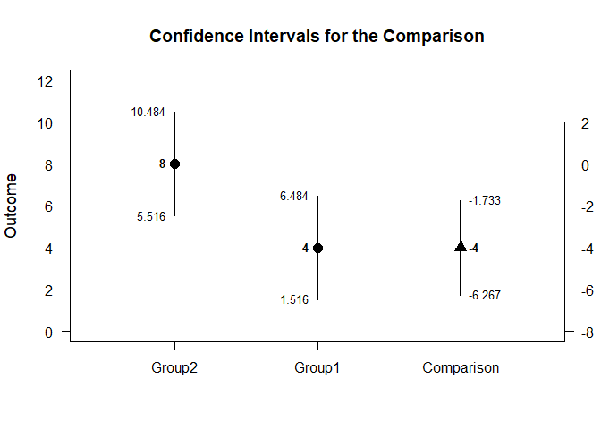<!-- -->

```r
.cipDifference(Outcome~Comparison,conf.level=.99)
```

<!-- -->

#### Significance Test of the Mean Difference


```r
.nhstDifference(Outcome~Comparison)
```

```
##            Diff    SE      t df     p
## Comparison   -4 0.816 -4.899  4 0.008
```

```r
.nhstDifference(Outcome~Comparison,mu=2)
```

```
##            Diff    SE      t df     p
## Comparison   -6 0.816 -7.348  4 0.002
```

### Analyses of Pairwise Comparisons

#### Confidence Intervals for the Pairwise Comparisons


```r
.ciPairwise(Outcome~Group)
```

```
##                 Diff    SE df     LL     UL
## Group1 v Group2   -4 0.816  4 -6.267 -1.733
## Group1 v Group3   -5 0.816  4 -7.267 -2.733
## Group2 v Group3   -1 0.816  4 -3.267  1.267
```

```r
.ciPairwise(Outcome~Group,conf.level=.99)
```

```
##                 Diff    SE df     LL     UL
## Group1 v Group2   -4 0.816  4 -7.759 -0.241
## Group1 v Group3   -5 0.816  4 -8.759 -1.241
## Group2 v Group3   -1 0.816  4 -4.759  2.759
```

#### Plot of the Confidence Intervals for the Pairwise Comparisons


```r
.cipPairwise(Outcome~Group)
```

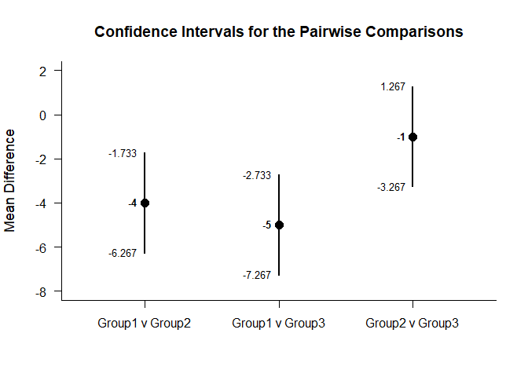<!-- -->

```r
.cipPairwise(Outcome~Group,mu=-2,conf.level=.99)
```

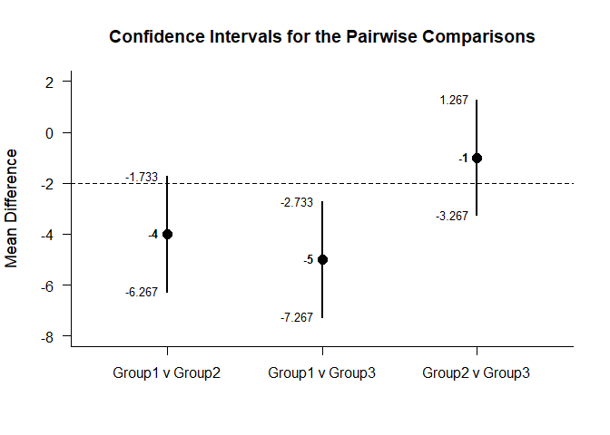<!-- -->

#### Significance Tests of the Pairwise Comparisons


```r
.nhstPairwise(Outcome~Group)
```

```
##                 Diff    SE      t df     p
## Group1 v Group2   -4 0.816 -4.899  4 0.008
## Group1 v Group3   -5 0.816 -6.124  4 0.004
## Group2 v Group3   -1 0.816 -1.225  4 0.288
```

```r
.nhstPairwise(Outcome~Group,mu=-2)
```

```
##                 Diff    SE      t df     p
## Group1 v Group2   -2 0.816 -2.449  4 0.070
## Group1 v Group3   -3 0.816 -3.674  4 0.021
## Group2 v Group3    1 0.816  1.225  4 0.288
```

### Analyses of a Set of Contrasts

#### Confidence Intervals for the Set of Contrasts


```r
.ciContrasts(Outcome~Group,contrasts=contr.sum)
```

```
##             Est    SE     LL     UL
## (Intercept)   7 0.333  6.184  7.816
## x1           -3 0.471 -4.153 -1.847
## x2            1 0.471 -0.153  2.153
```

```r
.ciContrasts(Outcome~Group,contrasts=contr.sum,conf.level=.99)
```

```
##             Est    SE     LL     UL
## (Intercept)   7 0.333  5.764  8.236
## x1           -3 0.471 -4.748 -1.252
## x2            1 0.471 -0.748  2.748
```

```r
.ciContrasts(Outcome~Group,contrasts=contr.treatment)
```

```
##             Est    SE    LL    UL
## (Intercept)   4 0.577 2.587 5.413
## x2            4 0.816 2.002 5.998
## x3            5 0.816 3.002 6.998
```

```r
.ciContrasts(Outcome~Group,contrasts=contr.poly)
```

```
##                Est    SE     LL    UL
## (Intercept)  7.000 0.333  6.184 7.816
## x.L          3.536 0.577  2.123 4.948
## x.Q         -1.225 0.577 -2.637 0.188
```

```r
.ciContrasts(Outcome~Group,contrasts=contr.helmert)
```

```
##             Est    SE    LL    UL
## (Intercept)   7 0.333 6.184 7.816
## x1            2 0.408 1.001 2.999
## x2            1 0.236 0.423 1.577
```

```r
.ciContrasts(Outcome~Group,contrasts=contr.SAS)
```

```
##             Est    SE     LL     UL
## (Intercept)   9 0.577  7.587 10.413
## x1           -5 0.816 -6.998 -3.002
## x2           -1 0.816 -2.998  0.998
```

#### Plot of the Confidence Intervals for the Set of Contrasts


```r
.cipContrasts(Outcome~Group,contrasts=contr.sum)
```

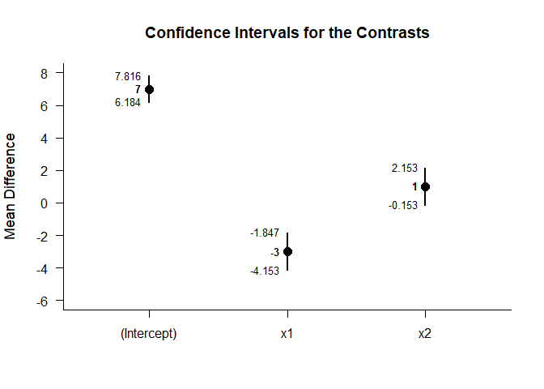<!-- -->

```r
.cipContrasts(Outcome~Group,contrasts=contr.sum,conf.level=.99)
```

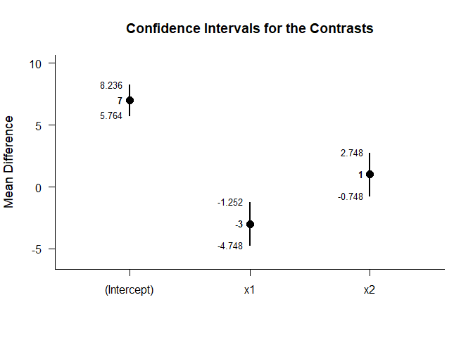<!-- -->

```r
.cipContrasts(Outcome~Group,contrasts=contr.treatment)
```

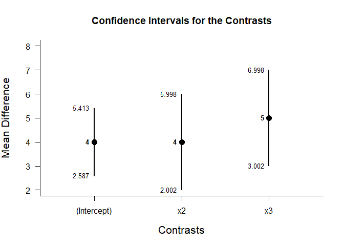<!-- -->

```r
.cipContrasts(Outcome~Group,contrasts=contr.poly)
```

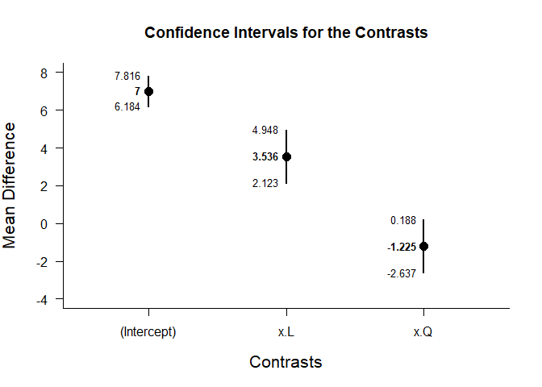<!-- -->

```r
.cipContrasts(Outcome~Group,contrasts=contr.helmert)
```

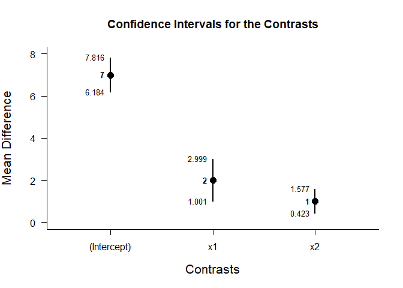<!-- -->

```r
.cipContrasts(Outcome~Group,contrasts=contr.SAS)
```

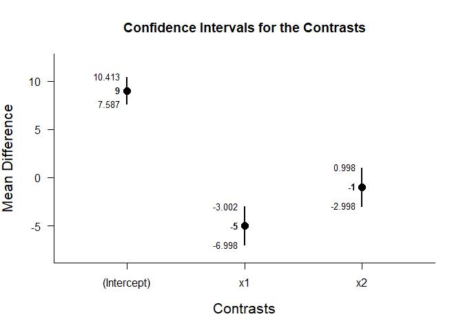<!-- -->

#### Significance Tests of the Set of Contrasts


```r
.nhstContrasts(Outcome~Group,contrasts=contr.sum)
```

```
##             Diff    SE      t     p
## (Intercept)    7 0.333 21.000 0.000
## x1            -3 0.471 -6.364 0.001
## x2             1 0.471  2.121 0.078
```

```r
.nhstContrasts(Outcome~Group,contrasts=contr.treatment)
```

```
##             Diff    SE     t     p
## (Intercept)    4 0.577 6.928 0.000
## x2             4 0.816 4.899 0.003
## x3             5 0.816 6.124 0.001
```

```r
.nhstContrasts(Outcome~Group,contrasts=contr.poly)
```

```
##               Diff    SE      t     p
## (Intercept)  7.000 0.333 21.000 0.000
## x.L          3.536 0.577  6.124 0.001
## x.Q         -1.225 0.577 -2.121 0.078
```

```r
.nhstContrasts(Outcome~Group,contrasts=contr.helmert)
```

```
##             Diff    SE      t     p
## (Intercept)    7 0.333 21.000 0.000
## x1             2 0.408  4.899 0.003
## x2             1 0.236  4.243 0.005
```

```r
.nhstContrasts(Outcome~Group,contrasts=contr.SAS)
```

```
##             Diff    SE      t     p
## (Intercept)    9 0.577 15.588 0.000
## x1            -5 0.816 -6.124 0.001
## x2            -1 0.816 -1.225 0.267
```
