# Estimation Approach to Statistical Inference
## OneWay Subjects Vignette

### Data Management

#### Data Entry


```r
Factor <- c(rep(1,4),rep(2,4),rep(3,4))
Outcome <- c(0,0,3,5,4,7,4,9,9,6,4,9)
Factor <- factor(Factor,levels=c(1,2,3),labels=c("Level1","Level2","Level3"))
OneWayData <- data.frame(Factor,Outcome)
```

#### Inspect Data


```r
OneWayData
```

```
##    Factor Outcome
## 1  Level1       0
## 2  Level1       0
## 3  Level1       3
## 4  Level1       5
## 5  Level2       4
## 6  Level2       7
## 7  Level2       4
## 8  Level2       9
## 9  Level3       9
## 10 Level3       6
## 11 Level3       4
## 12 Level3       9
```

```r
plotBoxes(Outcome~Factor)
addData(Outcome~Factor)
```

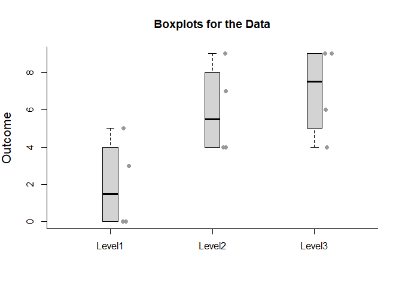<!-- -->

#### Descriptive Statistics


```r
describeMeans(Outcome~Factor)
```

```
## 
## DESCRIPTIVE STATISTICS FOR THE DATA
## 
##        N M    SD
## Level1 4 2 2.449
## Level2 4 6 2.449
## Level3 4 7 2.449
```

### Analyses of a Model

#### Describe a Model


```r
describeModel(Outcome~Factor)
```

```
## 
## SOURCE TABLE FOR THE MODEL
## 
##           SS df MS
## Factor    56  2 28
## Residuals 54  9  6
```

#### Overall Fit of a Model


```r
fitModel(Outcome~Factor)
```

```
## 
## PROPORTION OF VARIANCE ACCOUNTED FOR BY THE MODEL
## 
##           R    R2 AdjR2
## Model 0.714 0.509   0.4
```

#### Significance Test of a Model


```r
testModel(Outcome~Factor)
```

```
## 
## HYPOTHESIS TEST FOR THE MODEL
## 
##           F df1 df2     p
## Model 4.667   2   9 0.041
```

### Analyses of the Factor Means

#### Confidence Intervals for the Means


```r
estimateMeans(Outcome~Factor)
```

```
## 
## CONFIDENCE INTERVALS FOR THE MEANS
## 
##        M    SE df     LL    UL
## Level1 2 1.225  9 -0.771 4.771
## Level2 6 1.225  9  3.229 8.771
## Level3 7 1.225  9  4.229 9.771
```

```r
estimateMeans(Outcome~Factor,conf.level=.99)
```

```
## 
## CONFIDENCE INTERVALS FOR THE MEANS
## 
##        M    SE df    LL    UL
## Level1 2 1.225  9 -1.98  5.98
## Level2 6 1.225  9  2.02  9.98
## Level3 7 1.225  9  3.02 10.98
```

#### Plot of the Confidence Intervals for the Means


```r
plotMeans(Outcome~Factor)
```

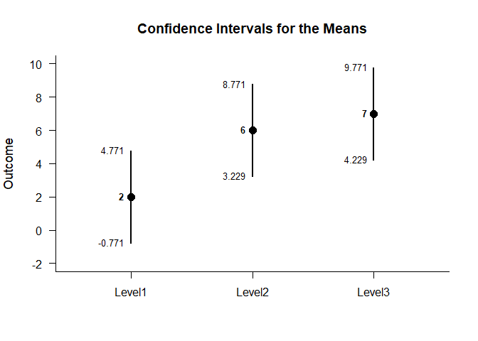<!-- -->

```r
plotMeans(Outcome~Factor,conf.level=.99,mu=5)
```

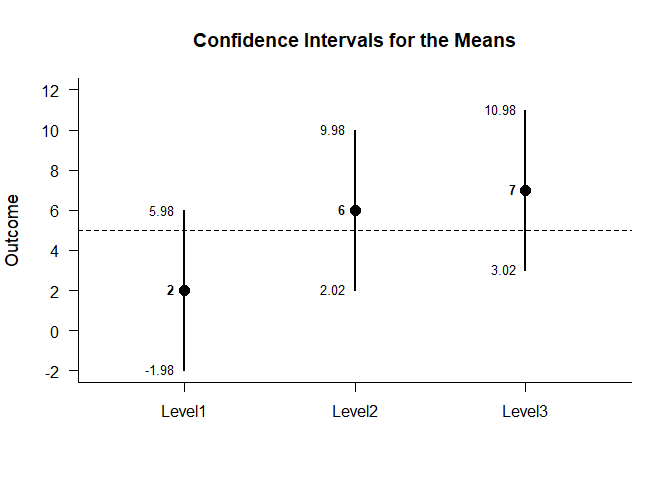<!-- -->

#### Significance Tests for the Means


```r
testMeans(Outcome~Factor)
```

```
## 
## HYPOTHESIS TESTS FOR THE MEANS
## 
##        Diff    SE     t df     p
## Level1    2 1.225 1.633  9 0.137
## Level2    6 1.225 4.899  9 0.001
## Level3    7 1.225 5.715  9 0.000
```

```r
testMeans(Outcome~Factor,mu=5)
```

```
## 
## HYPOTHESIS TESTS FOR THE MEANS
## 
##        Diff    SE      t df     p
## Level1   -3 1.225 -2.449  9 0.037
## Level2    1 1.225  0.816  9 0.435
## Level3    2 1.225  1.633  9 0.137
```

### Analyses of a Factor Comparison

#### Confidence Interval for a Mean Difference


```r
Comparison=factor(Factor,c("Level1","Level2"))
estimateDifference(Outcome~Comparison)
```

```
## 
## CONFIDENCE INTERVAL FOR THE COMPARISON
## 
##            Diff    SE df     LL    UL
## Comparison   -4 1.732  6 -8.238 0.238
```

```r
estimateDifference(Outcome~Comparison,conf.level=.99)
```

```
## 
## CONFIDENCE INTERVAL FOR THE COMPARISON
## 
##            Diff    SE df     LL    UL
## Comparison   -4 1.732  6 -8.238 0.238
```

```r
Comparison=factor(Factor,c("Level3","Level1"))
estimateDifference(Outcome~Comparison)
```

```
## 
## CONFIDENCE INTERVAL FOR THE COMPARISON
## 
##            Diff    SE df    LL    UL
## Comparison    5 1.732  6 0.762 9.238
```

#### Plot of the Confidence Interval for the Mean Difference


```r
Comparison=factor(Factor,c("Level1","Level2"))
plotDifference(Outcome~Comparison)
```

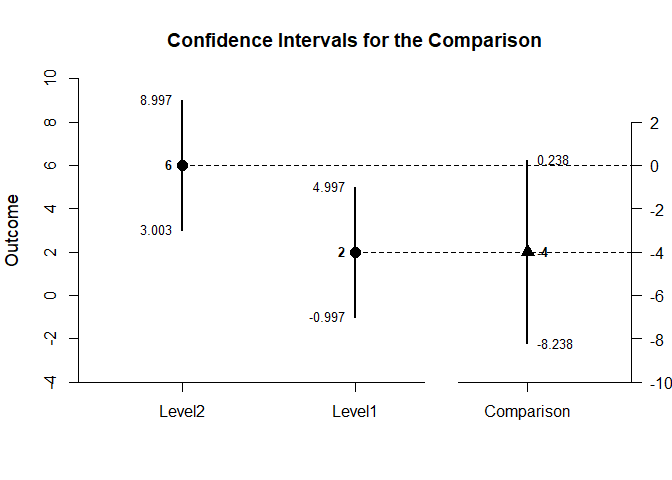<!-- -->

```r
plotDifference(Outcome~Comparison,conf.level=.99)
```

<!-- -->

#### Significance Test of the Mean Difference


```r
testDifference(Outcome~Comparison)
```

```
## 
## HYPOTHESIS TEST FOR THE COMPARISON
## 
##            Diff    SE      t df    p
## Comparison   -4 1.732 -2.309  6 0.06
```

```r
testDifference(Outcome~Comparison,mu=-2)
```

```
## 
## HYPOTHESIS TEST FOR THE COMPARISON
## 
##            Diff    SE      t df     p
## Comparison   -2 1.732 -1.155  6 0.292
```

### Analyses of Pairwise Comparisons

#### Confidence Intervals for the Pairwise Comparisons


```r
estimatePairwise(Outcome~Factor)
```

```
## 
## CONFIDENCE INTERVALS FOR THE PAIRWISE COMPARISONS
## 
##                 Diff    SE df     LL     UL
## Level1 v Level2   -4 1.732  6 -8.238  0.238
## Level1 v Level3   -5 1.732  6 -9.238 -0.762
## Level2 v Level3   -1 1.732  6 -5.238  3.238
```

```r
estimatePairwise(Outcome~Factor,conf.level=.99)
```

```
## 
## CONFIDENCE INTERVALS FOR THE PAIRWISE COMPARISONS
## 
##                 Diff    SE df      LL    UL
## Level1 v Level2   -4 1.732  6 -10.421 2.421
## Level1 v Level3   -5 1.732  6 -11.421 1.421
## Level2 v Level3   -1 1.732  6  -7.421 5.421
```

#### Plot of the Confidence Intervals for the Pairwise Comparisons


```r
plotPairwise(Outcome~Factor)
```

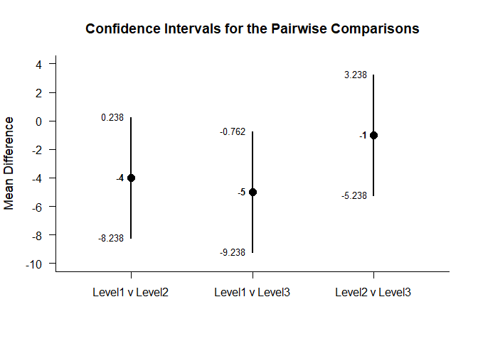<!-- -->

```r
plotPairwise(Outcome~Factor,mu=-2,conf.level=.99)
```

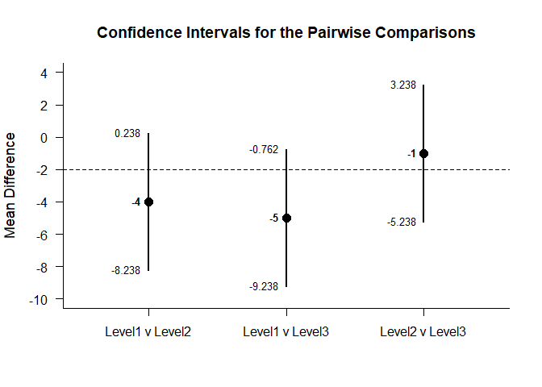<!-- -->

#### Significance Tests of the Pairwise Comparisons


```r
testPairwise(Outcome~Factor)
```

```
## 
## HYPOTHESIS TESTS FOR THE PAIRWISE COMPARISONS
## 
##                 Diff    SE      t df     p
## Level1 v Level2   -4 1.732 -2.309  6 0.060
## Level1 v Level3   -5 1.732 -2.887  6 0.028
## Level2 v Level3   -1 1.732 -0.577  6 0.585
```

```r
testPairwise(Outcome~Factor,mu=-2)
```

```
## 
## HYPOTHESIS TESTS FOR THE PAIRWISE COMPARISONS
## 
##                 Diff    SE      t df     p
## Level1 v Level2   -2 1.732 -1.155  6 0.292
## Level1 v Level3   -3 1.732 -1.732  6 0.134
## Level2 v Level3    1 1.732  0.577  6 0.585
```

### Analyses of a Set of Contrasts

#### Confidence Intervals for the Set of Contrasts


```r
estimateContrasts(Outcome~Factor,contrasts=contr.sum)
```

```
## 
## CONFIDENCE INTERVALS FOR THE CONTRASTS
## 
##             Est    SE df     LL     UL
## (Intercept)   5 0.707  9  3.400  6.600
## x1           -3 1.000  9 -5.262 -0.738
## x2            1 1.000  9 -1.262  3.262
```

```r
estimateContrasts(Outcome~Factor,contrasts=contr.sum,conf.level=.99)
```

```
## 
## CONFIDENCE INTERVALS FOR THE CONTRASTS
## 
##             Est    SE df     LL    UL
## (Intercept)   5 0.707  9  2.702 7.298
## x1           -3 1.000  9 -6.250 0.250
## x2            1 1.000  9 -2.250 4.250
```

```r
estimateContrasts(Outcome~Factor,contrasts=contr.treatment)
```

```
## 
## CONFIDENCE INTERVALS FOR THE CONTRASTS
## 
##             Est    SE df     LL    UL
## (Intercept)   2 1.225  9 -0.771 4.771
## x2            4 1.732  9  0.082 7.918
## x3            5 1.732  9  1.082 8.918
```

```r
estimateContrasts(Outcome~Factor,contrasts=contr.poly)
```

```
## 
## CONFIDENCE INTERVALS FOR THE CONTRASTS
## 
##                Est    SE df     LL    UL
## (Intercept)  5.000 0.707  9  3.400 6.600
## x.L          3.536 1.225  9  0.765 6.306
## x.Q         -1.225 1.225  9 -3.995 1.546
```

```r
estimateContrasts(Outcome~Factor,contrasts=contr.helmert)
```

```
## 
## CONFIDENCE INTERVALS FOR THE CONTRASTS
## 
##             Est    SE df     LL    UL
## (Intercept)   5 0.707  9  3.400 6.600
## x1            2 0.866  9  0.041 3.959
## x2            1 0.500  9 -0.131 2.131
```

```r
estimateContrasts(Outcome~Factor,contrasts=contr.SAS)
```

```
## 
## CONFIDENCE INTERVALS FOR THE CONTRASTS
## 
##             Est    SE df     LL     UL
## (Intercept)   7 1.225  9  4.229  9.771
## x1           -5 1.732  9 -8.918 -1.082
## x2           -1 1.732  9 -4.918  2.918
```

#### Plot of the Confidence Intervals for the Set of Contrasts


```r
plotContrasts(Outcome~Factor,contrasts=contr.sum)
```

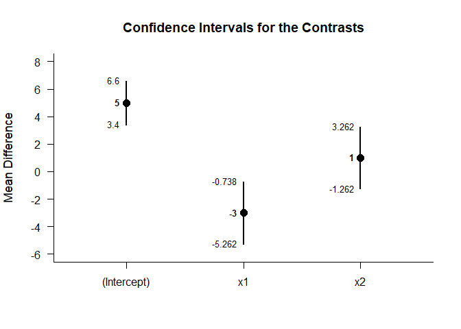<!-- -->

```r
plotContrasts(Outcome~Factor,contrasts=contr.sum,conf.level=.99)
```

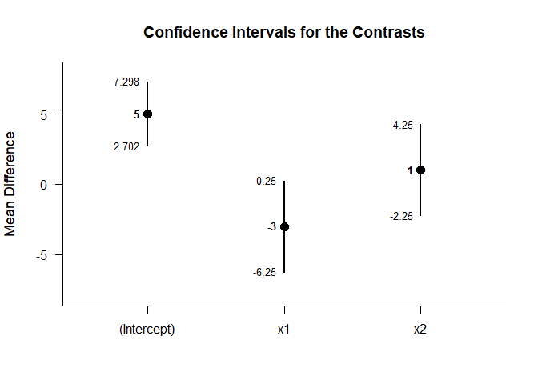<!-- -->

```r
plotContrasts(Outcome~Factor,contrasts=contr.treatment)
```

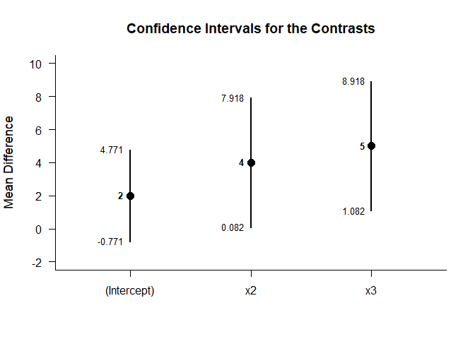<!-- -->

```r
plotContrasts(Outcome~Factor,contrasts=contr.poly)
```

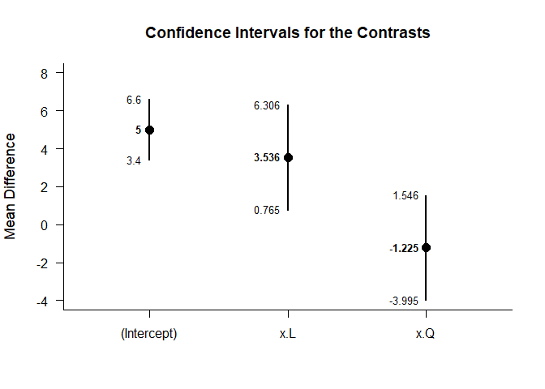<!-- -->

```r
plotContrasts(Outcome~Factor,contrasts=contr.helmert)
```

<!-- -->

```r
plotContrasts(Outcome~Factor,contrasts=contr.SAS)
```

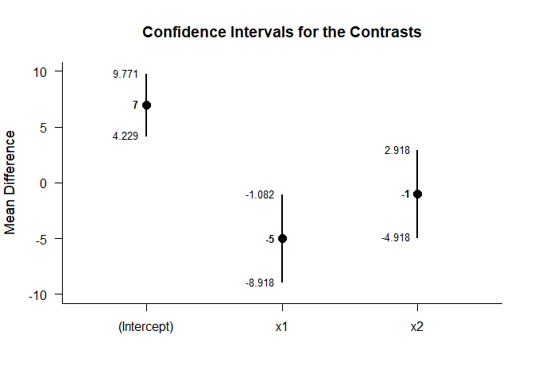<!-- -->

#### Significance Tests of the Set of Contrasts


```r
testContrasts(Outcome~Factor,contrasts=contr.sum)
```

```
## 
## HYPOTHESIS TESTS FOR THE CONTRASTS
## 
##             Diff    SE      t df     p
## (Intercept)    5 0.707  7.071  9 0.000
## x1            -3 1.000 -3.000  9 0.015
## x2             1 1.000  1.000  9 0.343
```

```r
testContrasts(Outcome~Factor,contrasts=contr.treatment)
```

```
## 
## HYPOTHESIS TESTS FOR THE CONTRASTS
## 
##             Diff    SE     t df     p
## (Intercept)    2 1.225 1.633  9 0.137
## x2             4 1.732 2.309  9 0.046
## x3             5 1.732 2.887  9 0.018
```

```r
testContrasts(Outcome~Factor,contrasts=contr.poly)
```

```
## 
## HYPOTHESIS TESTS FOR THE CONTRASTS
## 
##               Diff    SE      t df     p
## (Intercept)  5.000 0.707  7.071  9 0.000
## x.L          3.536 1.225  2.887  9 0.018
## x.Q         -1.225 1.225 -1.000  9 0.343
```

```r
testContrasts(Outcome~Factor,contrasts=contr.helmert)
```

```
## 
## HYPOTHESIS TESTS FOR THE CONTRASTS
## 
##             Diff    SE     t df     p
## (Intercept)    5 0.707 7.071  9 0.000
## x1             2 0.866 2.309  9 0.046
## x2             1 0.500 2.000  9 0.077
```

```r
testContrasts(Outcome~Factor,contrasts=contr.SAS)
```

```
## 
## HYPOTHESIS TESTS FOR THE CONTRASTS
## 
##             Diff    SE      t df     p
## (Intercept)    7 1.225  5.715  9 0.000
## x1            -5 1.732 -2.887  9 0.018
## x2            -1 1.732 -0.577  9 0.578
```
