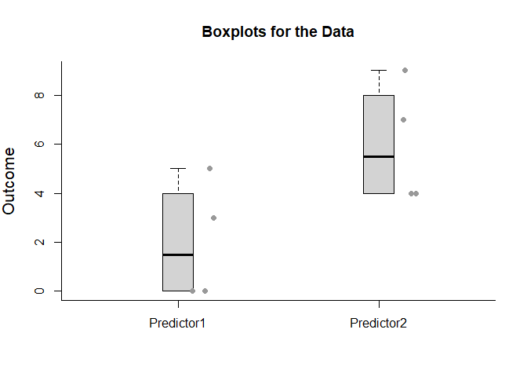
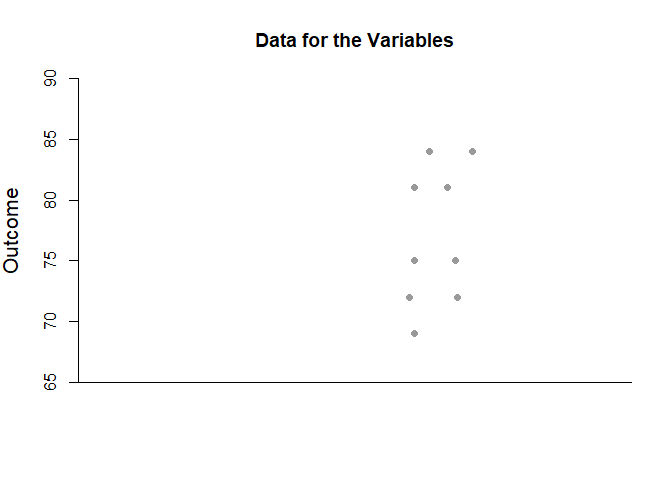
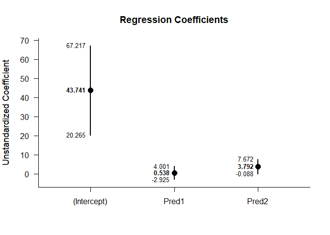
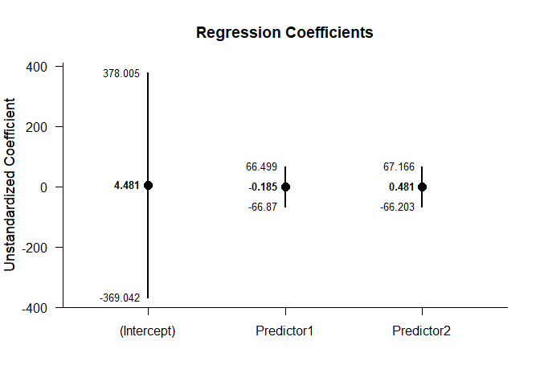

# Estimation Approach to Statistical Inference
## Regression Vignette

### Contents

- [Data Management](#data-management)
- [Analyses of a Regression Model](#analyses-of-a-regression-model)
- [Analyses of the Regression Coefficients](#analyses-of-the-regression-coefficients)

### Data Management

#### Data Entry


```r
Predictor1 <- c(0,0,3,5)
Predictor2 <- c(4,7,4,9)
Criterion <- c(9,6,4,9)
RegressionData <- data.frame(Predictor1,Predictor2,Criterion)
```

#### Inspect Data


```r
RegressionData
```

```
##   Predictor1 Predictor2 Criterion
## 1          0          4         9
## 2          0          7         6
## 3          3          4         4
## 4          5          9         9
```

```r
describeBoxes(Predictor1,Predictor2)
```

```
## 
## BOX PLOT SUMMARIES FOR THE DATA
## 
##            Min LQ Mdn UQ Max
## Predictor1   0  0 1.5  4   5
## Predictor2   4  4 5.5  8   9
```

```r
plotBoxes(Predictor1,Predictor2)
addData(Predictor1,Predictor2)
```

<!-- -->

```r
describeBoxes(Criterion)
```

```
## 
## BOX PLOT SUMMARIES FOR THE DATA
## 
##           Min LQ Mdn UQ Max
## Criterion   4  5 7.5  9   9
```

```r
plotBoxes(Criterion)
addData(Criterion)
```

<!-- -->

#### Descriptive Statistics


```r
describeMeans(Predictor1,Predictor2,Criterion)
```

```
## 
## DESCRIPTIVE STATISTICS FOR THE DATA
## 
##            N M    SD
## Predictor1 4 2 2.449
## Predictor2 4 6 2.449
## Criterion  4 7 2.449
```

### Analyses of a Regression Model

#### Overall Fit of Regression Model


```r
describeModel(Criterion~Predictor1+Predictor2)
```

```
## 
## SOURCE TABLE FOR THE MODEL
## 
##                SS df     MS
## Predictor1  0.056  1  0.056
## Predictor2  3.130  1  3.130
## Residuals  14.815  1 14.815
```

#### Significance Test of the Regression Model


```r
testModel(Criterion~Predictor1+Predictor2)
```

```
## 
## HYPOTHESIS TEST FOR THE MODEL
## 
##           F df1 df2     p
## Model 0.107   2   1 0.907
```

### Analyses of the Regression Coefficients

#### Confidence Intervals for the Regression Coefficients


```r
estimateRegression(Criterion~Predictor1+Predictor2)
```

```
## 
## CONFIDENCE INTERVALS FOR THE REGRESSION COEFFICENTS
## 
##                Est    SE df      LL     UL
## (Intercept)  4.481 5.868  1 -70.076 79.039
## Predictor1  -0.185 1.048  1 -13.496 13.125
## Predictor2   0.481 1.048  1 -12.829 13.792
```

```r
estimateRegression(Criterion~Predictor1+Predictor2,conf.level=.99)
```

```
## 
## CONFIDENCE INTERVALS FOR THE REGRESSION COEFFICENTS
## 
##                Est    SE df       LL      UL
## (Intercept)  4.481 5.868  1 -369.042 378.005
## Predictor1  -0.185 1.048  1  -66.870  66.499
## Predictor2   0.481 1.048  1  -66.203  67.166
```

#### Plot of the Confidence Intervals for the Regression Coefficients


```r
plotRegression(Criterion~Predictor1+Predictor2)
```

<!-- -->

```r
plotRegression(Criterion~Predictor1+Predictor2,conf.level=.99)
```

<!-- -->

#### Significance Tests for the Regression Coefficients


```r
testRegression(Criterion~Predictor1+Predictor2)
```

```
## 
## HYPOTHESIS TESTS FOR THE REGRESSION COEFFICIENTS
## 
##                Est    SE      t df     p
## (Intercept)  4.481 5.868  0.764  1 0.585
## Predictor1  -0.185 1.048 -0.177  1 0.889
## Predictor2   0.481 1.048  0.460  1 0.726
```
