# Estimation Approach to Statistical Inference
## Repeated Vignette

### Data Management

#### Data Entry


```r
Outcome1 <- c(0,0,3,5)
Outcome2 <- c(4,7,4,9)
Outcome3 <- c(9,6,4,9)
RepeatedData <- data.frame(Outcome1,Outcome2,Outcome3)
```

#### Inspect Data


```r
RepeatedData
```

```
##   Outcome1 Outcome2 Outcome3
## 1        0        4        9
## 2        0        7        6
## 3        3        4        4
## 4        5        9        9
```

```r
plotBoxes(Outcome1,Outcome2,Outcome3)
addData(Outcome1,Outcome2,Outcome3)
```

<!-- -->

#### Descriptive Statistics


```r
describeMeans(Outcome1,Outcome2,Outcome3)
```

```
## 
## DESCRIPTIVE STATISTICS FOR THE DATA
## 
##          N M    SD
## Outcome1 4 2 2.449
## Outcome2 4 6 2.449
## Outcome3 4 7 2.449
```

### Analyses of a Model

#### Describe a Model


```r
describeModel(Outcome1,Outcome2,Outcome3)
```

```
## 
## SOURCE TABLE FOR THE MODEL
## 
##               SS df     MS
## Variables 56.000  2 28.000
## Subjects  29.333  3  9.778
## Residual  24.667  6  4.111
```

#### Overall Fit of a Model


```r
fitModel(Outcome1,Outcome2,Outcome3)
```

```
## 
## PROPORTION OF VARIANCE ACCOUNTED FOR BY THE MODEL
## 
##           R    R2 AdjR2
## Model 0.881 0.776 0.589
```

#### Significance Test of a Model


```r
testModel(Outcome1,Outcome2,Outcome3)
```

```
## 
## HYPOTHESIS TEST FOR THE MODEL
## 
##           F df1 df2     p
## Model 4.151   5   6 0.056
```

### Analyses of the Variable Means

#### Confidence Intervals for the Means


```r
estimateMeans(Outcome1,Outcome2,Outcome3)
```

```
## 
## CONFIDENCE INTERVALS FOR THE MEANS
## 
##          M    SE df     LL    UL
## Outcome1 2 1.225  9 -0.771 4.771
## Outcome2 6 1.225  9  3.229 8.771
## Outcome3 7 1.225  9  4.229 9.771
```

```r
estimateMeans(Outcome1,Outcome2,Outcome3,conf.level=.99)
```

```
## 
## CONFIDENCE INTERVALS FOR THE MEANS
## 
##          M    SE df    LL    UL
## Outcome1 2 1.225  9 -1.98  5.98
## Outcome2 6 1.225  9  2.02  9.98
## Outcome3 7 1.225  9  3.02 10.98
```

#### Plots of Confidence Intervals for the Means


```r
plotMeans(Outcome1,Outcome2,Outcome3)
```

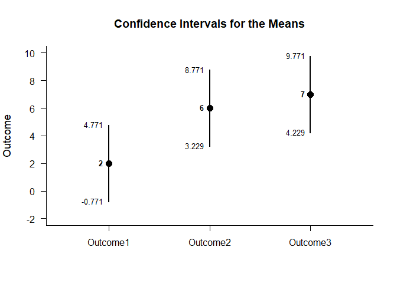<!-- -->

```r
plotMeans(Outcome1,Outcome2,Outcome3,conf.level=.99,mu=5)
```

<!-- -->

#### Significance Tests for the Means


```r
testMeans(Outcome1,Outcome2,Outcome3)
```

```
## 
## HYPOTHESIS TESTS FOR THE MEANS
## 
##          Diff    SE     t df     p
## Outcome1    2 1.225 1.633  9 0.137
## Outcome2    6 1.225 4.899  9 0.001
## Outcome3    7 1.225 5.715  9 0.000
```

```r
testMeans(Outcome1,Outcome2,Outcome3,mu=5)
```

```
## 
## HYPOTHESIS TESTS FOR THE MEANS
## 
##          Diff    SE      t df     p
## Outcome1   -3 1.225 -2.449  9 0.037
## Outcome2    1 1.225  0.816  9 0.435
## Outcome3    2 1.225  1.633  9 0.137
```

### Analyses of a Variable Comparison

#### Confidence Interval for the Mean Difference


```r
estimateDifference(Outcome1,Outcome2)
```

```
## 
## CONFIDENCE INTERVAL FOR THE COMPARISON
## 
##            Diff    SE df     LL     UL
## Comparison   -4 1.225  3 -7.898 -0.102
```

```r
estimateDifference(Outcome1,Outcome2,conf.level=.99)
```

```
## 
## CONFIDENCE INTERVAL FOR THE COMPARISON
## 
##            Diff    SE df     LL     UL
## Comparison   -4 1.225  3 -7.898 -0.102
```

```r
estimateDifference(Outcome3,Outcome1)
```

```
## 
## CONFIDENCE INTERVAL FOR THE COMPARISON
## 
##            Diff    SE df     LL     UL
## Comparison    5 1.683  3 -0.357 10.357
```

#### Plots of Confidence Intervals for the Mean Difference


```r
plotDifference(Outcome1,Outcome2)
```

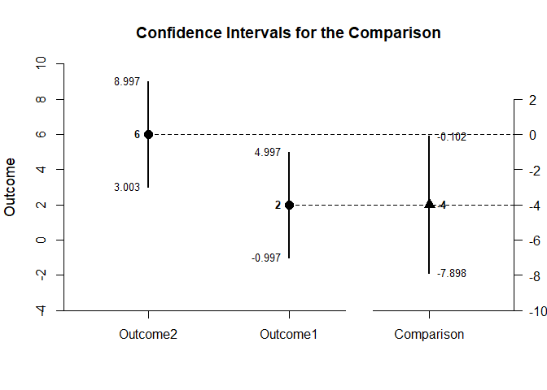<!-- -->

```r
plotDifference(Outcome1,Outcome2,conf.level=.99)
```

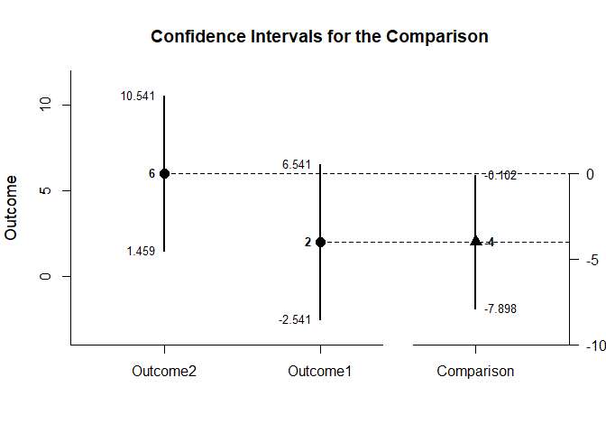<!-- -->

#### Significance Test for the Mean Difference


```r
testDifference(Outcome1,Outcome2)
```

```
## 
## HYPOTHESIS TEST FOR THE COMPARISON
## 
##            Diff    SE      t df     p
## Comparison   -4 1.225 -3.266  3 0.047
```

```r
testDifference(Outcome1,Outcome2,mu=-2)
```

```
## 
## HYPOTHESIS TEST FOR THE COMPARISON
## 
##            Diff    SE      t df     p
## Comparison   -4 1.225 -1.633  3 0.201
```

### Analyses of Pairwise Comparisons

#### Confidence Intervals for the Pairwise Comparisons


```r
estimatePairwise(Outcome1,Outcome2,Outcome3)
```

```
## 
## CONFIDENCE INTERVALS FOR THE PAIRWISE COMPARISONS
## 
##                     Diff    SE df      LL     UL
## Outcome1 v Outcome2   -4 1.225  3  -7.898 -0.102
## Outcome1 v Outcome3   -5 1.683  3 -10.357  0.357
## Outcome2 v Outcome3   -1 1.354  3  -5.309  3.309
```

```r
estimatePairwise(Outcome1,Outcome2,Outcome3,conf.level=.99)
```

```
## 
## CONFIDENCE INTERVALS FOR THE PAIRWISE COMPARISONS
## 
##                     Diff    SE df      LL    UL
## Outcome1 v Outcome2   -4 1.225  3 -11.154 3.154
## Outcome1 v Outcome3   -5 1.683  3 -14.832 4.832
## Outcome2 v Outcome3   -1 1.354  3  -8.909 6.909
```

#### Plot of the Confidence Intervals for the Pairwise Comparisons


```r
plotPairwise(Outcome1,Outcome2,Outcome3)
```

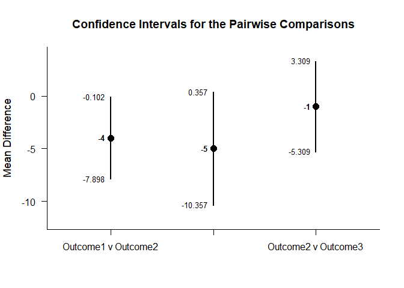<!-- -->

```r
plotPairwise(Outcome1,Outcome2,Outcome3,mu=-2,conf.level=.99)
```

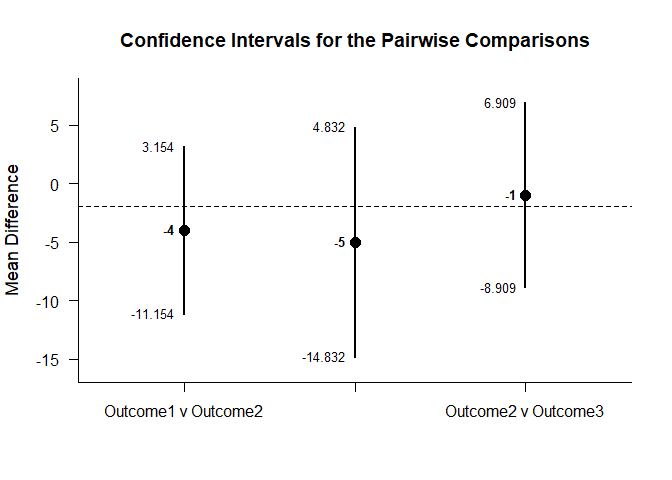<!-- -->

#### Significance Tests of the Pairwise Comparisons


```r
testPairwise(Outcome1,Outcome2,Outcome3)
```

```
## 
## HYPOTHESIS TESTS FOR THE PAIRWISE COMPARISONS
## 
##                     Diff    SE      t df     p
## Outcome1 v Outcome2   -4 1.225 -3.266  3 0.047
## Outcome1 v Outcome3   -5 1.683 -2.970  3 0.059
## Outcome2 v Outcome3   -1 1.354 -0.739  3 0.514
```

```r
testPairwise(Outcome1,Outcome2,Outcome3,mu=-2)
```

```
## 
## HYPOTHESIS TESTS FOR THE PAIRWISE COMPARISONS
## 
##                     Diff    SE      t df     p
## Outcome1 v Outcome2   -4 1.225 -1.633  3 0.201
## Outcome1 v Outcome3   -5 1.683 -1.782  3 0.173
## Outcome2 v Outcome3   -1 1.354  0.739  3 0.514
```

### Analyses of a Set of Contrasts

#### Confidence Intervals for the Set of Contrasts


```r
estimateContrasts(Outcome1,Outcome2,Outcome3,contrasts=contr.sum)
```

```
## 
## CONFIDENCE INTERVALS FOR THE CONTRASTS
## 
##             Est    SE df     LL     UL
## (Intercept)   5 0.585  6  3.568  6.432
## Variable1    -3 0.828  6 -5.025 -0.975
## Variable2     1 0.828  6 -1.025  3.025
```

```r
estimateContrasts(Outcome1,Outcome2,Outcome3,contrasts=contr.sum,conf.level=.99)
```

```
## 
## CONFIDENCE INTERVALS FOR THE CONTRASTS
## 
##             Est    SE df     LL    UL
## (Intercept)   5 0.585  6  2.830 7.170
## Variable1    -3 0.828  6 -6.069 0.069
## Variable2     1 0.828  6 -2.069 4.069
```

```r
estimateContrasts(Outcome1,Outcome2,Outcome3,contrasts=contr.treatment)
```

```
## 
## CONFIDENCE INTERVALS FOR THE CONTRASTS
## 
##             Est    SE df     LL    UL
## (Intercept)   2 1.014  6 -0.481 4.481
## Variable2     4 1.434  6  0.492 7.508
## Variable3     5 1.434  6  1.492 8.508
```

```r
estimateContrasts(Outcome1,Outcome2,Outcome3,contrasts=contr.poly)
```

```
## 
## CONFIDENCE INTERVALS FOR THE CONTRASTS
## 
##                Est    SE df     LL    UL
## (Intercept)  5.000 0.585  6  3.568 6.432
## Variable.L   3.536 1.014  6  1.055 6.016
## Variable.Q  -1.225 1.014  6 -3.705 1.256
```

```r
estimateContrasts(Outcome1,Outcome2,Outcome3,contrasts=contr.helmert)
```

```
## 
## CONFIDENCE INTERVALS FOR THE CONTRASTS
## 
##             Est    SE df     LL    UL
## (Intercept)   5 0.585  6  3.568 6.432
## Variable1     2 0.717  6  0.246 3.754
## Variable2     1 0.414  6 -0.013 2.013
```

```r
estimateContrasts(Outcome1,Outcome2,Outcome3,contrasts=contr.SAS)
```

```
## 
## CONFIDENCE INTERVALS FOR THE CONTRASTS
## 
##             Est    SE df     LL     UL
## (Intercept)   7 1.014  6  4.519  9.481
## Variable1    -5 1.434  6 -8.508 -1.492
## Variable2    -1 1.434  6 -4.508  2.508
```

#### Plot of the Confidence Intervals for the Set of Contrasts


```r
plotContrasts(Outcome1,Outcome2,Outcome3,contrasts=contr.sum)
```

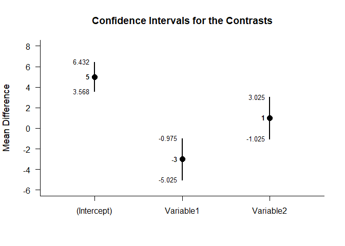<!-- -->

```r
plotContrasts(Outcome1,Outcome2,Outcome3,contrasts=contr.sum,conf.level=.99)
```

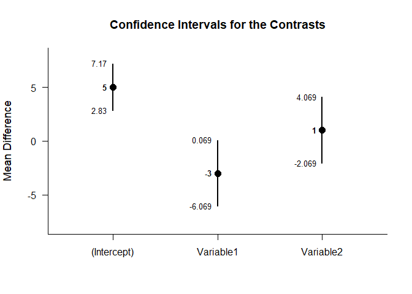<!-- -->

```r
plotContrasts(Outcome1,Outcome2,Outcome3,contrasts=contr.treatment)
```

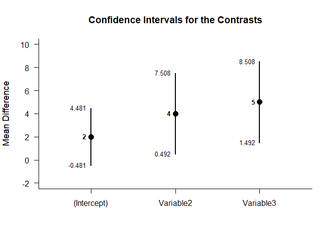<!-- -->

```r
plotContrasts(Outcome1,Outcome2,Outcome3,contrasts=contr.poly)
```

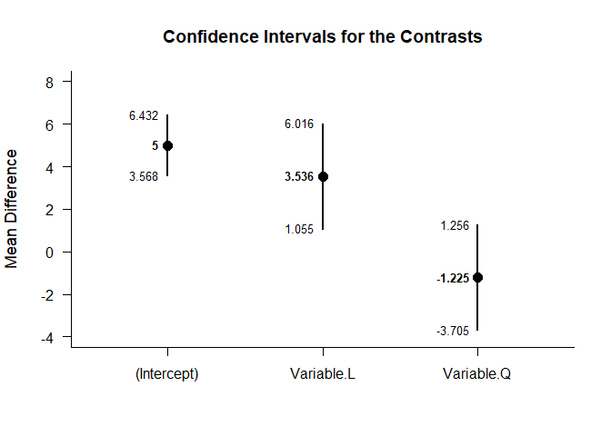<!-- -->

```r
plotContrasts(Outcome1,Outcome2,Outcome3,contrasts=contr.helmert)
```

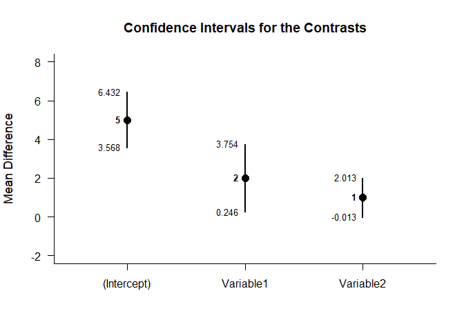<!-- -->

```r
plotContrasts(Outcome1,Outcome2,Outcome3,contrasts=contr.SAS)
```

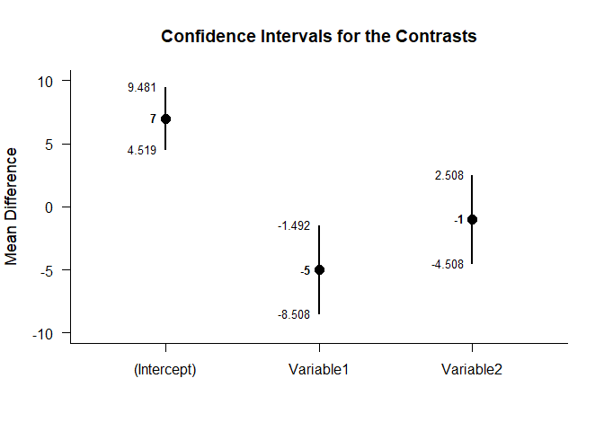<!-- -->

#### Significance Tests of the Set of Contrasts


```r
testContrasts(Outcome1,Outcome2,Outcome3,contrasts=contr.sum)
```

```
## 
## HYPOTHESIS TESTS FOR THE CONTRASTS
## 
##             Diff    SE      t df     p
## (Intercept)    5 0.585  8.542  6 0.000
## Variable1     -3 0.828 -3.624  6 0.011
## Variable2      1 0.828  1.208  6 0.272
```

```r
testContrasts(Outcome1,Outcome2,Outcome3,contrasts=contr.treatment)
```

```
## 
## HYPOTHESIS TESTS FOR THE CONTRASTS
## 
##             Diff    SE     t df     p
## (Intercept)    2 1.014 1.973  6 0.096
## Variable2      4 1.434 2.790  6 0.032
## Variable3      5 1.434 3.487  6 0.013
```

```r
testContrasts(Outcome1,Outcome2,Outcome3,contrasts=contr.poly)
```

```
## 
## HYPOTHESIS TESTS FOR THE CONTRASTS
## 
##               Diff    SE      t df     p
## (Intercept)  5.000 0.585  8.542  6 0.000
## Variable.L   3.536 1.014  3.487  6 0.013
## Variable.Q  -1.225 1.014 -1.208  6 0.272
```

```r
testContrasts(Outcome1,Outcome2,Outcome3,contrasts=contr.helmert)
```

```
## 
## HYPOTHESIS TESTS FOR THE CONTRASTS
## 
##             Diff    SE     t df     p
## (Intercept)    5 0.585 8.542  6 0.000
## Variable1      2 0.717 2.790  6 0.032
## Variable2      1 0.414 2.416  6 0.052
```

```r
testContrasts(Outcome1,Outcome2,Outcome3,contrasts=contr.SAS)
```

```
## 
## HYPOTHESIS TESTS FOR THE CONTRASTS
## 
##             Diff    SE      t df     p
## (Intercept)    7 1.014  6.905  6 0.000
## Variable1     -5 1.434 -3.487  6 0.013
## Variable2     -1 1.434 -0.697  6 0.512
```
