# Estimation Approach to Statistical Inference
## Within Subjects Vignette

### Data Management

#### Data Entry


```r
Time1 <- c(5,6,6,7,8)
Time2 <- c(7,7,8,8,9)
Time3 <- c(8,8,9,9,9)
WithinData <- data.frame(Time1,Time2,Time3)
```

#### Inspect Data


```r
WithinData
```

```
##   Time1 Time2 Time3
## 1     5     7     8
## 2     6     7     8
## 3     6     8     9
## 4     7     8     9
## 5     8     9     9
```

```r
plotData(Time1,Time2,Time3)
```

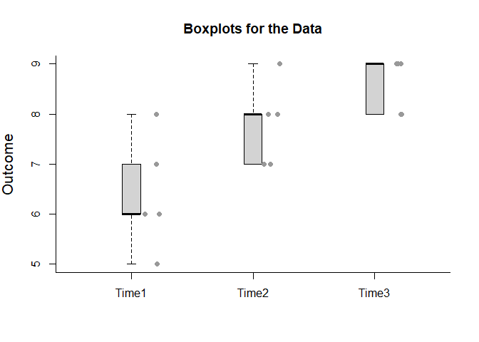<!-- -->

#### Descriptive Statistics


```r
describeMeans(Time1,Time2,Time3)
```

```
## 
## DESCRIPTIVE STATISTICS FOR THE DATA
## 
##       N   M    SD
## Time1 5 6.4 1.140
## Time2 5 7.8 0.837
## Time3 5 8.6 0.548
```

### Analyses of a Model

#### Describe a Model


```r
describeModel(Time1,Time2,Time3)
```

```
## 
## SOURCE TABLE FOR THE MODEL
## 
##             SS df  MS
## Variables 12.4  2 6.2
## Subjects   7.6  4 1.9
## Residual   1.6  8 0.2
```

#### Overall Fit of a Model


```r
fitModel(Time1,Time2,Time3)
```

```
## 
## PROPORTION OF VARIANCE ACCOUNTED FOR BY THE MODEL
## 
##           R    R2 AdjR2
## Model 0.962 0.926  0.87
```

#### Significance Test of a Model


```r
testModel(Time1,Time2,Time3)
```

```
## 
## HYPOTHESIS TEST FOR THE MODEL
## 
##            F df1 df2 p
## Model 16.667   6   8 0
```

### Analyses of the Variable Means

#### Confidence Intervals for the Means


```r
estimateMeans(Time1,Time2,Time3)
```

```
## 
## CONFIDENCE INTERVALS FOR THE MEANS
## 
##         M    SE df    LL    UL
## Time1 6.4 0.510  4 4.984 7.816
## Time2 7.8 0.374  4 6.761 8.839
## Time3 8.6 0.245  4 7.920 9.280
```

```r
estimateMeans(Time1,Time2,Time3,conf.level=.99)
```

```
## 
## CONFIDENCE INTERVALS FOR THE MEANS
## 
##         M    SE df    LL    UL
## Time1 6.4 0.510  4 4.052 8.748
## Time2 7.8 0.374  4 6.077 9.523
## Time3 8.6 0.245  4 7.472 9.728
```

#### Plots of Confidence Intervals for the Means


```r
plotMeans(Time1,Time2,Time3)
```

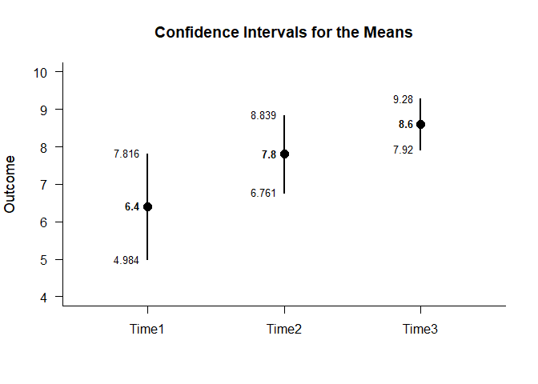<!-- -->

```r
plotMeans(Time1,Time2,Time3,conf.level=.99,mu=6)
```

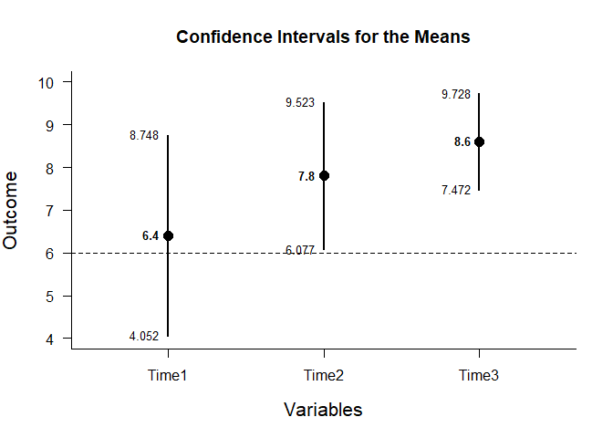<!-- -->

#### Significance Tests for the Means


```r
testMeans(Time1,Time2,Time3)
```

```
## 
## HYPOTHESIS TESTS FOR THE MEANS
## 
##       Diff    SE      t df p
## Time1  6.4 0.510 12.551  4 0
## Time2  7.8 0.374 20.846  4 0
## Time3  8.6 0.245 35.109  4 0
```

```r
testMeans(Time1,Time2,Time3,mu=6)
```

```
## 
## HYPOTHESIS TESTS FOR THE MEANS
## 
##       Diff    SE      t df     p
## Time1  0.4 0.510  0.784  4 0.477
## Time2  1.8 0.374  4.811  4 0.009
## Time3  2.6 0.245 10.614  4 0.000
```

### Analyses of a Variable Comparison

#### Confidence Interval for the Mean Difference


```r
estimateDifference(Time1,Time2)
```

```
## 
## CONFIDENCE INTERVAL FOR THE COMPARISON
## 
##            Diff    SE df    LL    UL
## Comparison -1.4 0.245  4 -2.08 -0.72
```

```r
estimateDifference(Time1,Time2,conf.level=.99)
```

```
## 
## CONFIDENCE INTERVAL FOR THE COMPARISON
## 
##            Diff    SE df    LL    UL
## Comparison -1.4 0.245  4 -2.08 -0.72
```

```r
estimateDifference(Time3,Time1)
```

```
## 
## CONFIDENCE INTERVAL FOR THE COMPARISON
## 
##            Diff    SE df    LL    UL
## Comparison  2.2 0.374  4 1.161 3.239
```

#### Plots of Confidence Intervals for the Mean Difference


```r
plotDifference(Time1,Time2)
```

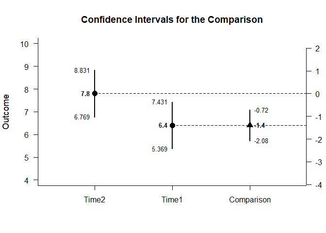<!-- -->

```r
plotDifference(Time1,Time2,conf.level=.99)
```

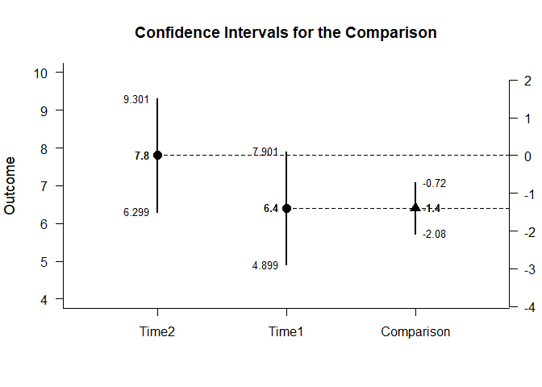<!-- -->

#### Significance Test for the Mean Difference


```r
testDifference(Time1,Time2)
```

```
## 
## HYPOTHESIS TEST FOR THE COMPARISON
## 
##            Diff    SE      t df     p
## Comparison -1.4 0.245 -5.715  4 0.005
```

```r
testDifference(Time1,Time2,mu=-2)
```

```
## 
## HYPOTHESIS TEST FOR THE COMPARISON
## 
##            Diff    SE     t df    p
## Comparison -1.4 0.245 2.449  4 0.07
```

### Analyses of Pairwise Comparisons

#### Confidence Intervals for the Pairwise Comparisons


```r
estimatePairwise(Time1,Time2,Time3)
```

```
## 
## CONFIDENCE INTERVALS FOR THE PAIRWISE COMPARISONS
## 
##               Diff    SE df     LL     UL
## Time1 v Time2 -1.4 0.245  4 -2.080 -0.720
## Time1 v Time3 -2.2 0.374  4 -3.239 -1.161
## Time2 v Time3 -0.8 0.200  4 -1.355 -0.245
```

```r
estimatePairwise(Time1,Time2,Time3,conf.level=.99)
```

```
## 
## CONFIDENCE INTERVALS FOR THE PAIRWISE COMPARISONS
## 
##               Diff    SE df     LL     UL
## Time1 v Time2 -1.4 0.245  4 -2.528 -0.272
## Time1 v Time3 -2.2 0.374  4 -3.923 -0.477
## Time2 v Time3 -0.8 0.200  4 -1.721  0.121
```

#### Plot of the Confidence Intervals for the Pairwise Comparisons


```r
plotPairwise(Time1,Time2,Time3)
```

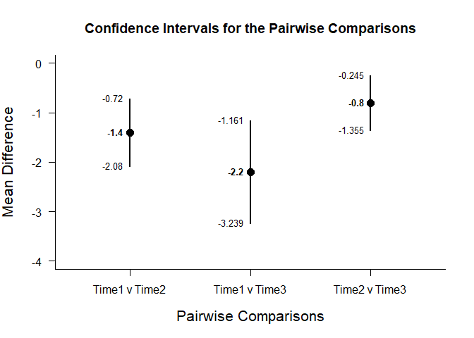<!-- -->

```r
plotPairwise(Time1,Time2,Time3,mu=-2,conf.level=.99)
```

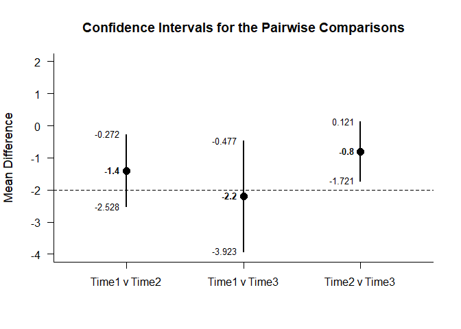<!-- -->

#### Significance Tests of the Pairwise Comparisons


```r
testPairwise(Time1,Time2,Time3)
```

```
## 
## HYPOTHESIS TESTS FOR THE PAIRWISE COMPARISONS
## 
##               Diff    SE      t df     p
## Time1 v Time2 -1.4 0.245 -5.715  4 0.005
## Time1 v Time3 -2.2 0.374 -5.880  4 0.004
## Time2 v Time3 -0.8 0.200 -4.000  4 0.016
```

```r
testPairwise(Time1,Time2,Time3,mu=-2)
```

```
## 
## HYPOTHESIS TESTS FOR THE PAIRWISE COMPARISONS
## 
##               Diff    SE      t df     p
## Time1 v Time2 -1.4 0.245  2.449  4 0.070
## Time1 v Time3 -2.2 0.374 -0.535  4 0.621
## Time2 v Time3 -0.8 0.200  6.000  4 0.004
```

### Analyses of a Set of Contrasts

#### Confidence Intervals for the Set of Contrasts


```r
estimateContrasts(Time1,Time2,Time3,contrasts=contr.sum)
```

```
## 
## CONFIDENCE INTERVALS FOR THE CONTRASTS
## 
##              Est    SE     LL     UL
## (Intercept)  7.6 0.115  7.334  7.866
## Variable1   -1.2 0.163 -1.577 -0.823
## Variable2    0.2 0.163 -0.177  0.577
```

```r
estimateContrasts(Time1,Time2,Time3,contrasts=contr.sum,conf.level=.99)
```

```
## 
## CONFIDENCE INTERVALS FOR THE CONTRASTS
## 
##              Est    SE     LL     UL
## (Intercept)  7.6 0.115  7.213  7.987
## Variable1   -1.2 0.163 -1.748 -0.652
## Variable2    0.2 0.163 -0.348  0.748
```

```r
estimateContrasts(Time1,Time2,Time3,contrasts=contr.treatment)
```

```
## 
## CONFIDENCE INTERVALS FOR THE CONTRASTS
## 
##             Est    SE    LL    UL
## (Intercept) 6.4 0.200 5.939 6.861
## Variable2   1.4 0.283 0.748 2.052
## Variable3   2.2 0.283 1.548 2.852
```

```r
estimateContrasts(Time1,Time2,Time3,contrasts=contr.poly)
```

```
## 
## CONFIDENCE INTERVALS FOR THE CONTRASTS
## 
##                Est    SE     LL    UL
## (Intercept)  7.600 0.115  7.334 7.866
## Variable.L   1.556 0.200  1.094 2.017
## Variable.Q  -0.245 0.200 -0.706 0.216
```

```r
estimateContrasts(Time1,Time2,Time3,contrasts=contr.helmert)
```

```
## 
## CONFIDENCE INTERVALS FOR THE CONTRASTS
## 
##             Est    SE    LL    UL
## (Intercept) 7.6 0.115 7.334 7.866
## Variable1   0.7 0.141 0.374 1.026
## Variable2   0.5 0.082 0.312 0.688
```

```r
estimateContrasts(Time1,Time2,Time3,contrasts=contr.SAS)
```

```
## 
## CONFIDENCE INTERVALS FOR THE CONTRASTS
## 
##              Est    SE     LL     UL
## (Intercept)  8.6 0.200  8.139  9.061
## Variable1   -2.2 0.283 -2.852 -1.548
## Variable2   -0.8 0.283 -1.452 -0.148
```

#### Plot of the Confidence Intervals for the Set of Contrasts


```r
plotContrasts(Time1,Time2,Time3,contrasts=contr.sum)
```

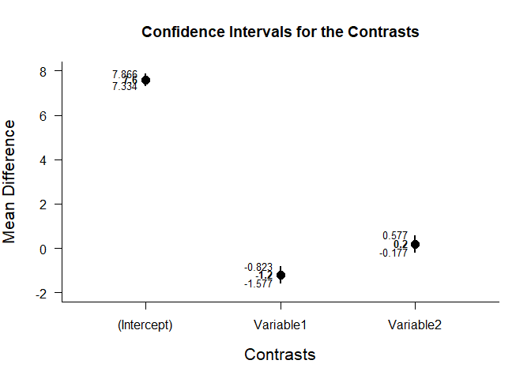<!-- -->

```r
plotContrasts(Time1,Time2,Time3,contrasts=contr.sum,conf.level=.99)
```

<!-- -->

```r
plotContrasts(Time1,Time2,Time3,contrasts=contr.treatment)
```

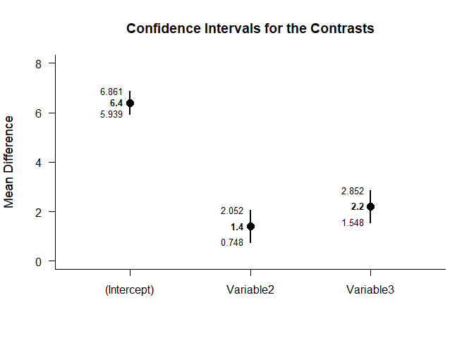<!-- -->

```r
plotContrasts(Time1,Time2,Time3,contrasts=contr.poly)
```

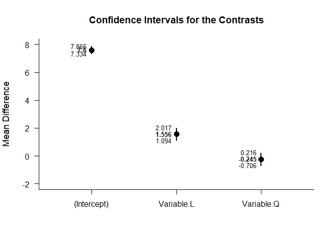<!-- -->

```r
plotContrasts(Time1,Time2,Time3,contrasts=contr.helmert)
```

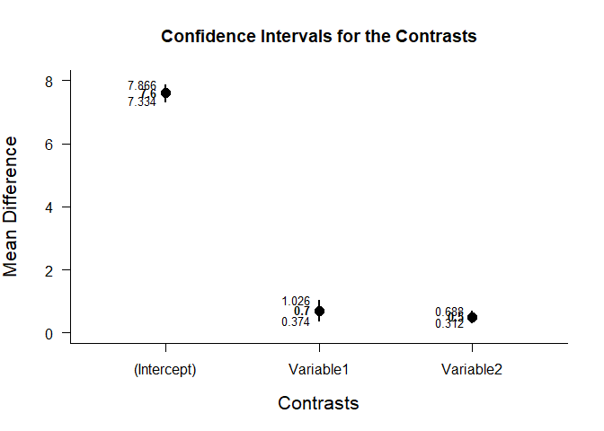<!-- -->

```r
plotContrasts(Time1,Time2,Time3,contrasts=contr.SAS)
```

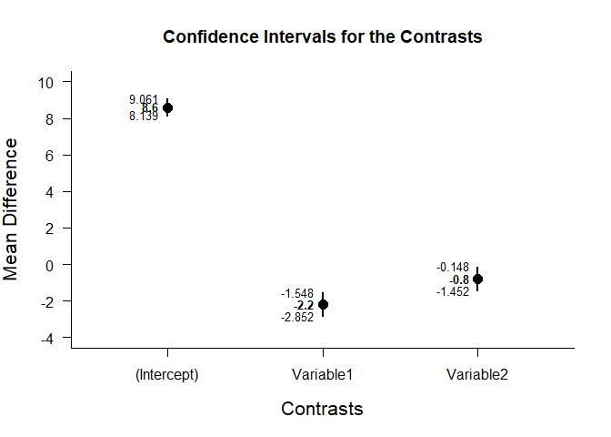<!-- -->

#### Significance Tests of the Set of Contrasts


```r
testContrasts(Time1,Time2,Time3,contrasts=contr.sum)
```

```
## 
## HYPOTHESIS TESTS FOR THE CONTRASTS
## 
##             Diff    SE      t     p
## (Intercept)  7.6 0.115 65.818 0.000
## Variable1   -1.2 0.163 -7.348 0.000
## Variable2    0.2 0.163  1.225 0.256
```

```r
testContrasts(Time1,Time2,Time3,contrasts=contr.treatment)
```

```
## 
## HYPOTHESIS TESTS FOR THE CONTRASTS
## 
##             Diff    SE      t     p
## (Intercept)  6.4 0.200 32.000 0.000
## Variable2    1.4 0.283  4.950 0.001
## Variable3    2.2 0.283  7.778 0.000
```

```r
testContrasts(Time1,Time2,Time3,contrasts=contr.poly)
```

```
## 
## HYPOTHESIS TESTS FOR THE CONTRASTS
## 
##               Diff    SE      t     p
## (Intercept)  7.600 0.115 65.818 0.000
## Variable.L   1.556 0.200  7.778 0.000
## Variable.Q  -0.245 0.200 -1.225 0.256
```

```r
testContrasts(Time1,Time2,Time3,contrasts=contr.helmert)
```

```
## 
## HYPOTHESIS TESTS FOR THE CONTRASTS
## 
##             Diff    SE      t     p
## (Intercept)  7.6 0.115 65.818 0.000
## Variable1    0.7 0.141  4.950 0.001
## Variable2    0.5 0.082  6.124 0.000
```

```r
testContrasts(Time1,Time2,Time3,contrasts=contr.SAS)
```

```
## 
## HYPOTHESIS TESTS FOR THE CONTRASTS
## 
##             Diff    SE      t     p
## (Intercept)  8.6 0.200 43.000 0.000
## Variable1   -2.2 0.283 -7.778 0.000
## Variable2   -0.8 0.283 -2.828 0.022
```
